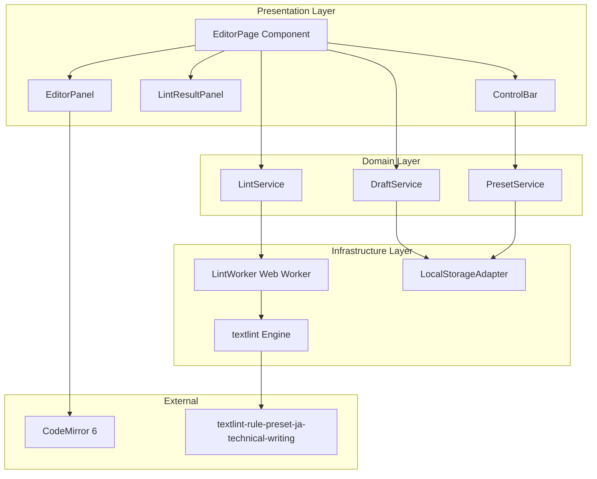
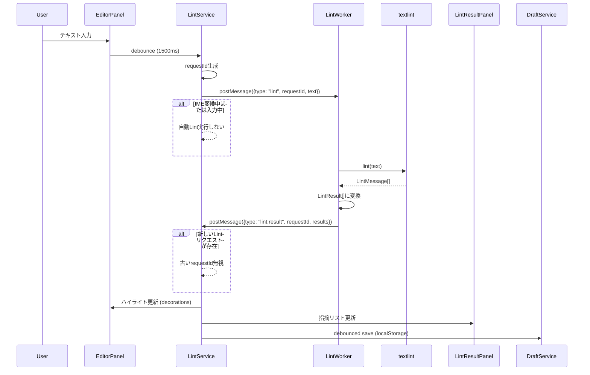
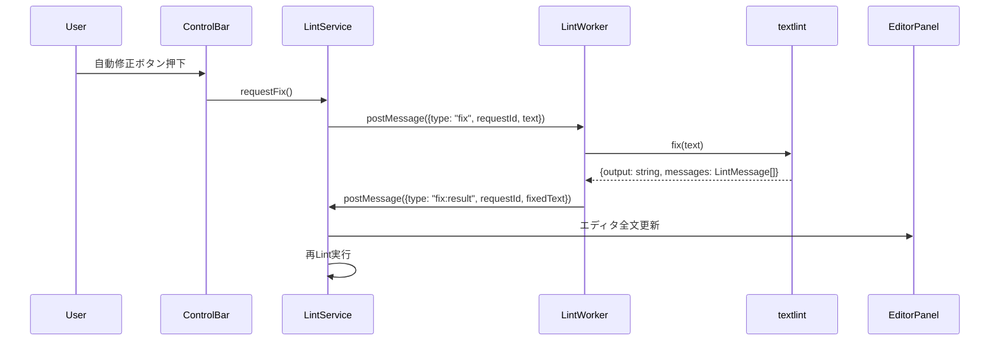
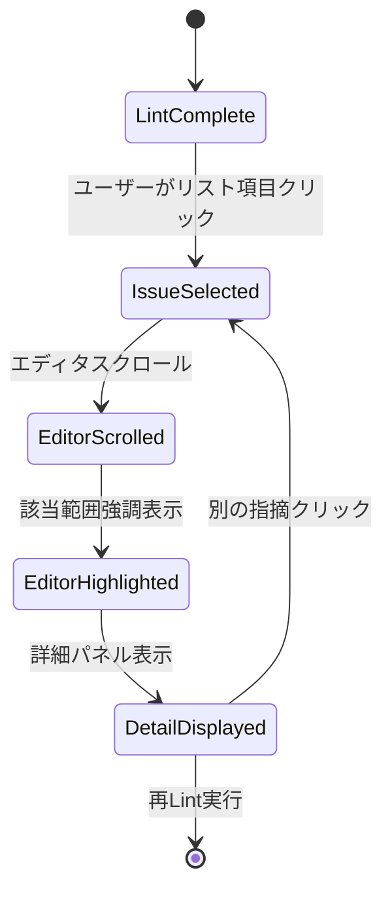

# Technical Design Document

## Overview

本機能は、技術記事作成者向けの日本語文章Lint Webエディタ（MVP）を提供する。textlintをブラウザ上でローカル実行し、文法・表記揺れ・冗長表現などの問題を自動検出することで、レビュー前に最低品質ラインを突破させる。

**Users**: 技術記事作成者（個人ブログ、技術メディア寄稿者、社内ドキュメント執筆者）が、執筆時にリアルタイムで文章品質をチェックする。

**Impact**: レビュー工数削減、内容レビューへの集中促進、執筆者の自主的な品質向上を実現する。

### Goals

- ブラウザ上でtextlintをローカル実行し、プライバシーを保護しながら文章品質をチェック
- 指摘箇所のリアルタイム表示とナビゲーションにより、修正作業を効率化
- 安全な自動修正機能により、手作業の負担を削減
- ドラフト自動保存により、作業の継続性を確保
- UIフリーズなしのパフォーマンスを実現（1万文字・指摘200件程度まで）

### Non-Goals

- 履歴管理・差分保存（MVP範囲外、将来拡張で検討）
- チーム運用機能（承認フロー等）
- 生成AIによる修正提案（将来拡張で検討、Requirement 13.3）
- 右ペインでの修正適用UI（MVP範囲外）
- スマートフォン・タブレット対応（ベストエフォート、Requirement 7.4）

## Architecture

### Architecture Pattern & Boundary Map

選択したアーキテクチャパターン: **Layered Architecture (Presentation-Domain-Infrastructure)**



**Architecture Integration**:
- **Selected pattern**: Layered Architecture - シンプルでMVPに最適、Next.jsのApp Router構造と自然に適合
- **Domain/feature boundaries**:
  - Presentation Layer: UIコンポーネント（エディタ、指摘パネル、コントロールバー）
  - Domain Layer: ビジネスロジック（Lint実行制御、ドラフト管理、プリセット管理）
  - Infrastructure Layer: 外部依存（Web Worker、localStorage、textlint）
- **Existing patterns preserved**: Next.jsのApp Router、Reactコンポーネント設計、TypeScript strict mode
- **New components rationale**:
  - LintWorker: UI非ブロック化（Requirement 1.6, 7.1）
  - LocalStorageAdapter: 将来的な複数ドラフト管理への拡張性確保（Requirement 13.1）
  - Service層: ビジネスロジックとUIの分離、テスタビリティ向上
- **Steering compliance**: 型安全性（strict mode）、バレルインポート禁止（個別インポート）、シンプルな構成

### Technology Stack

| Layer | Choice / Version | Role in Feature | Notes |
|-------|------------------|-----------------|-------|
| **Frontend** | Next.js 16.0.5 | App Router、SSG、クライアント専用ページ | 既存プロジェクト、Vercel最適化 |
| Frontend | React 19.2.0 | UIコンポーネント、Hooks | 既存プロジェクト |
| Frontend | TypeScript 5.x | 型安全性、strict mode | 既存プロジェクト |
| Frontend | Tailwind CSS 4.x | スタイリング | 既存プロジェクト |
| **Editor** | CodeMirror 6 | テキストエディタコンポーネント | dynamic import (ssr: false)、decorations |
| **Lint Engine** | textlint latest | 日本語文章Lint | Web Worker上で実行 |
| Lint Rules | textlint-rule-preset-ja-technical-writing | 技術記事向けルールセット | MVP唯一のプリセット |
| **Validation** | Valibot v1 | LintResultスキーマバリデーション | バンドルサイズ最小（1.37 kB） |
| **Runtime** | Bun latest | ローカル開発環境 | 既存プロジェクト |
| **Infrastructure** | Vercel | ホスティング、CDN | 既存プロジェクト |

**Key Technology Decisions**:
- **Valibot採用理由**: バンドルサイズ最小化（Zodの90%削減）、MVP段階の要件を満たす（詳細は`research.md`参照）
- **CodeMirror 6**: React統合実績豊富、decorationsによるハイライト実装、Next.js SSR制約への対応パターン確立
- **textlint**: JavaScript製でブラウザ実行可能、@textlint/script-compilerでWeb Worker最適化

## System Flows

### Lint実行フロー



**Key Decisions**:
- debounce 1500ms: Requirement 1.3（入力停止から1500ms経過で自動Lint）
- requestIdパターン: Requirement 1.5（最新の入力状態に対する結果のみ採用）
- IME判定: `isComposing`フラグでIME変換中の自動Lint抑制（Requirement 1.4）

### 自動修正（Auto Fix）フロー



**Key Decisions**:
- fix APIの使用: textlint公式のfix機能を信頼（Requirement 3.7）
- 全文更新: カーソル位置のズレを許容（MVP段階、将来的にdiff適用検討）
- 自動Lint時はFix実行しない: Requirement 3.8（カーソル位置のズレによる編集妨害防止）

### 指摘ナビゲーションフロー



**Key Decisions**:
- startIndex/endIndexベースのスクロール: UTF-16コード単位でCodeMirrorの位置計算と整合（Requirement 2.6）
- 選択状態リセット: 再Lint完了時に選択・強調解除（Requirement 2.5）

## Requirements Traceability

| Requirement | Summary | Components | Interfaces | Flows |
|-------------|---------|------------|------------|-------|
| 1.1 | CodeMirrorエディタ表示 | EditorPanel | EditorPanelProps | - |
| 1.2, 1.3 | 手動・自動Lint実行 | LintService, ControlBar | LintServiceInterface | Lint実行フロー |
| 1.4 | IME変換中は自動Lint停止 | LintService | - | Lint実行フロー |
| 1.5 | 最新リクエストのみ採用 | LintService | - | Lint実行フロー |
| 1.6 | Web WorkerでUI非ブロック | LintWorker | WorkerMessageProtocol | Lint実行フロー |
| 1.7 | Lint結果の返却 | LintWorker, LintResult型 | WorkerMessageProtocol | Lint実行フロー |
| 2.1, 2.2 | 指摘リスト表示 | LintResultPanel | LintResultPanelProps | - |
| 2.3 | 指摘クリックでジャンプ | LintResultPanel, EditorPanel | onIssueSelect | 指摘ナビゲーションフロー |
| 2.4 | エディタ内ハイライト | EditorPanel | - | Lint実行フロー |
| 2.5 | 再Lint時の選択リセット | LintService | - | 指摘ナビゲーションフロー |
| 2.6 | UTF-16位置計算 | EditorPanel, LintWorker | LintResult.startIndex/endIndex | Lint実行フロー |
| 3.1-3.8 | 自動修正 | LintService, ControlBar | LintServiceInterface.requestFix | 自動修正フロー |
| 4.1-4.6 | ドラフト管理 | DraftService, LocalStorageAdapter | DraftServiceInterface | Lint実行フロー |
| 5.1-5.4 | プリセット管理 | PresetService | PresetServiceInterface | - |
| 6.1-6.5 | セキュリティとプライバシー | 全コンポーネント | - | - |
| 7.1-7.6 | パフォーマンス | LintWorker, EditorPanel | - | 全フロー |
| 8.1-8.5 | ルールセット管理 | textlint設定ファイル | - | - |
| 9.1-9.5 | ホスティングとアーキテクチャ | Next.js, Vercel | - | - |
| 10.1-10.4 | エラーハンドリング | 全Serviceコンポーネント | ErrorResult型 | - |
| 11.1-11.5 | UIレイアウトと操作性 | EditorPage, EditorPanel, LintResultPanel, ControlBar | - | - |
| 12.1-12.3 | 多タブ挙動 | LocalStorageAdapter | - | - |
| 13.1-13.4 | 将来拡張への配慮 | LocalStorageAdapter, PresetService | - | - |
| 14.1-14.5 | 指摘の無視機能 | LintResultPanel, LocalStorageAdapter | - | - |
| 15.1-15.4 | データ構造とインターフェース仕様 | 全コンポーネント | WorkerMessageProtocol, LintResult型 | - |
| 16.1-16.3 | 成功指標（KPI） | - | - | - |

## Components and Interfaces

### Component Summary

| Component | Domain/Layer | Intent | Req Coverage | Key Dependencies (P0/P1) | Contracts |
|-----------|--------------|--------|--------------|--------------------------|-----------|
| EditorPage | Presentation | エディタページ全体のレイアウトと状態管理 | 11.1, 11.2 | LintService (P0), DraftService (P0), PresetService (P1) | State |
| EditorPanel | Presentation | CodeMirrorエディタとハイライト管理 | 1.1, 2.4, 2.6 | CodeMirror 6 (P0) | Service |
| LintResultPanel | Presentation | 指摘リストと詳細表示 | 2.1, 2.2, 2.3, 11.3, 11.4, 14.1-14.5 | - | Event |
| ControlBar | Presentation | Lint実行・自動修正・プリセット選択 | 11.2, 3.2, 3.3 | LintService (P0), PresetService (P1) | Event |
| LintService | Domain | Lint実行制御、Worker通信、状態管理 | 1.2-1.7, 3.4-3.6 | LintWorker (P0) | Service |
| DraftService | Domain | ドラフト自動保存とリストア | 4.1-4.6 | LocalStorageAdapter (P0) | Service |
| PresetService | Domain | プリセット管理 | 5.1-5.4 | LocalStorageAdapter (P1) | Service |
| LintWorker | Infrastructure | textlintのWeb Worker実行環境 | 1.6, 1.7, 7.1, 7.2 | textlint (P0), textlint-rule-preset-ja-technical-writing (P0) | API, Event |
| LocalStorageAdapter | Infrastructure | localStorage操作の抽象化 | 4.1-4.6, 13.1, 14.3 | - | Service |

### Presentation Layer

#### EditorPage

| Field | Detail |
|-------|--------|
| Intent | エディタページ全体のレイアウト、Lint状態、ドラフト状態の管理 |
| Requirements | 11.1, 11.2 |

**Responsibilities & Constraints**
- 左右2ペイン（EditorPanel / LintResultPanel）のレイアウト管理
- ControlBarの配置と全体的なUI構成
- Lint状態（実行中、エラー、完了）の管理
- ドラフトの初期ロードとページ間遷移の制御
- Domain layerのServiceインスタンス生成と子コンポーネントへの伝播

**Dependencies**
- Outbound: LintService - Lint実行制御 (P0)
- Outbound: DraftService - ドラフト管理 (P0)
- Outbound: PresetService - プリセット管理 (P1)
- Inbound: EditorPanel, LintResultPanel, ControlBar - 子コンポーネント (P0)

**Contracts**: State [x]

##### State Management

- **State model**:
  - `lintResults: LintResult[]` - 最新のLint結果
  - `isLinting: boolean` - Lint実行中フラグ
  - `selectedIssueId: string | null` - 選択中の指摘ID
  - `editorText: string` - エディタの現在テキスト
  - `currentPreset: string` - 選択中のプリセットID
  - `ignoredIssueIds: Set<string>` - 無視された指摘のID集合
- **Persistence & consistency**: ドラフトはDraftService経由でlocalStorageに永続化、Lint結果は揮発性（ページリロードで破棄）
- **Concurrency strategy**: Single-threaded React state、Lint Worker通信はrequestIdで制御

**Implementation Notes**
- **Integration**: `"use client"`ディレクティブ必須（CodeMirror、localStorageを使用）
- **Validation**: LintResult配列はValibotでスキーマバリデーション
- **Risks**: 大量指摘時（200件超）のstate更新パフォーマンス劣化 → useMemoで最適化

---

#### EditorPanel

| Field | Detail |
|-------|--------|
| Intent | CodeMirror 6ベースのテキストエディタとLintハイライトの管理 |
| Requirements | 1.1, 2.4, 2.6 |

**Responsibilities & Constraints**
- CodeMirror 6インスタンスの初期化と管理（useRef + useEffect）
- テキスト変更時のdebounced callback実行
- Lint結果に基づくdecorations（ハイライト）の適用
- 指摘選択時のスクロールと該当範囲の強調表示
- UTF-16コード単位ベースの位置計算とCodeMirrorのpos変換

**Dependencies**
- External: CodeMirror 6 - エディタコア (P0)
  - パッケージ: `codemirror`, `@codemirror/state`, `@codemirror/view`, `@codemirror/lang-markdown`
  - 最新安定版使用、dynamic import (ssr: false) で読み込み
- Inbound: EditorPage - 親コンポーネント (P0)

**Contracts**: Service [x]

##### Service Interface

```typescript
interface EditorPanelProps {
  initialText: string;
  lintResults: LintResult[];
  selectedIssueId: string | null;
  onTextChange: (text: string) => void;
  onIssueSelect: (issueId: string) => void;
  ignoredIssueIds: Set<string>;
}
```

- **Preconditions**:
  - `initialText`: 初期表示テキスト（空文字列可）
  - `lintResults`: Valibotでバリデーション済み
  - `ignoredIssueIds`: 無視された指摘のID集合
- **Postconditions**:
  - `onTextChange`: debounce後（300ms）にテキスト変更を通知
  - `onIssueSelect`: 指摘クリック時にissueIdを通知
- **Invariants**:
  - CodeMirrorインスタンスはuseRef管理、再レンダリング時も保持
  - decorationsはlintResults変更時のみ再適用

**Implementation Notes**
- **Integration**: dynamic import `const CodeMirrorEditor = dynamic(() => import('./CodeMirrorEditor'), { ssr: false })`
- **Validation**: startIndex/endIndexのUTF-16境界チェック（サロゲートペア考慮）
- **Risks**: 大量ハイライト時のパフォーマンス劣化 → RangeSet効率化、将来的にウィンドウイング方式検討

---

#### LintResultPanel

| Field | Detail |
|-------|--------|
| Intent | Lint指摘リストと選択中の指摘詳細を表示、無視機能を提供 |
| Requirements | 2.1, 2.2, 2.3, 11.3, 11.4, 14.1-14.5 |

**Responsibilities & Constraints**
- Lint結果のリスト表示（行番号、ルールID、メッセージ、重大度）
- 指摘アイテムのクリックイベント処理
- 選択中の指摘詳細（完全メッセージ、対象文、行番号）の表示
- 重大度（error/warning）の視覚的区別（色・アイコン）
- 指摘の無視機能（個別インスタンス単位）

**Dependencies**
- Inbound: EditorPage - 親コンポーネント (P0)

**Contracts**: Event [x]

##### Event Contract

- **Published events**: なし
- **Subscribed events**:
  - `onIssueSelect(issueId: string)`: 指摘アイテムクリック時
  - `onIssueIgnore(issueId: string)`: 指摘無視ボタンクリック時
- **Ordering / delivery guarantees**: 同期イベント、順序保証あり

```typescript
interface LintResultPanelProps {
  lintResults: LintResult[];
  selectedIssueId: string | null;
  onIssueSelect: (issueId: string) => void;
  onIssueIgnore: (issueId: string) => void;
  ignoredIssueIds: Set<string>;
}
```

**Implementation Notes**
- **Integration**: 無視された指摘はリストから除外（`lintResults.filter(r => !ignoredIssueIds.has(r.id))`）
- **Validation**: lintResultsのバリデーション済み前提
- **Risks**: 指摘200件超でスクロール性能劣化 → React.memo + virtualized list検討

---

#### ControlBar

| Field | Detail |
|-------|--------|
| Intent | Lint実行・自動修正・プリセット選択のコントロール |
| Requirements | 11.2, 3.2, 3.3 |

**Responsibilities & Constraints**
- 手動Lint実行ボタン
- 自動Lint ON/OFFトグル
- 自動修正ボタン（fixableな指摘がある場合のみ有効化）
- プリセット選択ドロップダウン（MVP段階では「技術記事」のみ）
- ドラフトクリアボタン

**Dependencies**
- Outbound: LintService - Lint実行、Fix実行 (P0)
- Outbound: PresetService - プリセット管理 (P1)
- Inbound: EditorPage - 親コンポーネント (P0)

**Contracts**: Event [x]

##### Event Contract

```typescript
interface ControlBarProps {
  isLinting: boolean;
  isAutoLintEnabled: boolean;
  fixableCount: number;
  currentPreset: string;
  onManualLint: () => void;
  onToggleAutoLint: (enabled: boolean) => void;
  onAutoFix: () => void;
  onPresetChange: (presetId: string) => void;
  onClearDraft: () => void;
}
```

**Implementation Notes**
- **Integration**: fixableCountは`lintResults.filter(r => r.fixable).length`で算出
- **Validation**: MVP段階ではプリセットは1つのみ、将来拡張で複数対応
- **Risks**: なし

---

### Domain Layer

#### LintService

| Field | Detail |
|-------|--------|
| Intent | Lint実行の制御、Web Worker通信、Lint結果の管理 |
| Requirements | 1.2-1.7, 3.4-3.6 |

**Responsibilities & Constraints**
- 手動/自動Lint実行のトリガー
- Web WorkerへのLint/Fixリクエスト送信（postMessage）
- requestIdによる非同期リクエストの管理
- IME変換中の自動Lint抑制
- Lint結果のバリデーションと状態管理
- Fix実行後の再Lint

**Dependencies**
- Outbound: LintWorker - textlint実行 (P0)
- Inbound: EditorPage, ControlBar - 親コンポーネント (P0)

**Contracts**: Service [x]

##### Service Interface

```typescript
interface LintServiceInterface {
  requestLint(text: string, isManual: boolean): Promise<void>;
  requestFix(text: string): Promise<string>;
  cancelPendingRequests(): void;
  getCurrentResults(): LintResult[];
}

type LintResult = {
  id: string;
  ruleId: string;
  message: string;
  line: number;
  column: number;
  startIndex: number;
  endIndex: number;
  severity: "error" | "warning";
  snippet: string;
  fixable: boolean;
  fixText?: string;
};
```

- **Preconditions**:
  - `text`: 非nullの文字列
  - `isManual`: 手動実行時はIME判定をスキップ
- **Postconditions**:
  - `requestLint`: Lint完了後、LintResult[]を返す
  - `requestFix`: Fix適用後のテキストを返し、再Lintを実行
- **Invariants**:
  - 最新のrequestIdのみ有効、古いリクエストは無視
  - Lint結果はValibotでバリデーション済み

**Implementation Notes**
- **Integration**: Web Workerの初期化はページロード時に実行（初回Lint時の遅延回避）
- **Validation**: Valibotスキーマで`LintResult[]`をバリデーション
- **Risks**: Worker起動時間が初回Lint遅延の原因 → 事前初期化で緩和

---

#### DraftService

| Field | Detail |
|-------|--------|
| Intent | ドラフトの自動保存とリストア、localStorageとの通信 |
| Requirements | 4.1-4.6 |

**Responsibilities & Constraints**
- Lint実行完了時のdebounced save（1000ms待機、3000ms最大待機）
- ページロード時のドラフトリストア
- ドラフトクリア操作の処理
- localStorage容量制限エラーのハンドリング

**Dependencies**
- Outbound: LocalStorageAdapter - localStorage操作 (P0)
- Inbound: EditorPage - 親コンポーネント (P0)

**Contracts**: Service [x]

##### Service Interface

```typescript
interface DraftServiceInterface {
  saveDraft(text: string): Result<void, DraftError>;
  loadDraft(): Result<string, DraftError>;
  clearDraft(): Result<void, DraftError>;
}

type DraftError =
  | { type: "quota_exceeded"; message: string }
  | { type: "storage_unavailable"; message: string };
```

- **Preconditions**: localStorageが利用可能
- **Postconditions**:
  - `saveDraft`: debounce後にlocalStorageに保存、成功時はOk、失敗時はErr
  - `loadDraft`: localStorage存在時はドラフトテキスト、不在時は空文字列
- **Invariants**: 単一キー`jlwe:currentDraftText`のみ使用、全文上書き

**Implementation Notes**
- **Integration**: useCallbackとlodash/debounceでdebounce実装
- **Validation**: localStorage容量制限（約5-10MB）超過時はErr返却、ユーザーに通知
- **Risks**: 複数タブ同時編集でLast Write Wins（Requirement 12.1）

---

#### PresetService

| Field | Detail |
|-------|--------|
| Intent | textlintプリセットの管理と切り替え |
| Requirements | 5.1-5.4 |

**Responsibilities & Constraints**
- MVP段階では「技術記事」プリセットのみ提供
- 将来的な複数プリセット拡張を想定した設計
- プリセット選択状態のlocalStorage永続化

**Dependencies**
- Outbound: LocalStorageAdapter - localStorage操作 (P1)
- Inbound: EditorPage, ControlBar - 親コンポーネント (P1)

**Contracts**: Service [x]

##### Service Interface

```typescript
interface PresetServiceInterface {
  getAvailablePresets(): Preset[];
  getCurrentPreset(): Preset;
  setCurrentPreset(presetId: string): Result<void, PresetError>;
}

type Preset = {
  id: string;
  name: string;
  description: string;
  rules: Record<string, unknown>;
};

type PresetError = { type: "preset_not_found"; presetId: string };
```

- **Preconditions**: MVP段階では1つのプリセットのみ
- **Postconditions**: プリセット切り替え後、Web Workerに新しいルール設定を通知
- **Invariants**: デフォルトプリセットは常に存在

**Implementation Notes**
- **Integration**: MVP段階ではハードコード、将来的に設定ファイル読み込み対応
- **Validation**: プリセットIDの存在チェック
- **Risks**: なし

---

### Infrastructure Layer

#### LintWorker

| Field | Detail |
|-------|--------|
| Intent | textlintをWeb Worker上で実行し、Lint/Fix結果を返す |
| Requirements | 1.6, 1.7, 7.1, 7.2 |

**Responsibilities & Constraints**
- textlint初期化（ルール読み込み、設定適用）
- Lintリクエストの受信と処理
- Fixリクエストの受信と処理
- textlint LintMessageからLintResultへの変換
- エラーハンドリングと親スレッドへの通知

**Dependencies**
- External: textlint - Lintエンジン (P0)
  - パッケージ: `textlint`, `@textlint/kernel`
  - @textlint/script-compilerでWeb Worker最適化されたバンドル生成
- External: textlint-rule-preset-ja-technical-writing - 技術記事ルールセット (P0)
  - 最新安定版使用
- Inbound: LintService - 親スレッド (P0)

**Contracts**: API [x], Event [x]

##### API Contract

| Method | Endpoint | Request | Response | Errors |
|--------|----------|---------|----------|--------|
| Lint | Worker.postMessage | `{type: "lint", requestId: string, text: string}` | `{type: "lint:result", requestId: string, results: LintResult[]}` | `{type: "lint:error", requestId: string, error: string}` |
| Fix | Worker.postMessage | `{type: "fix", requestId: string, text: string}` | `{type: "fix:result", requestId: string, fixedText: string}` | `{type: "fix:error", requestId: string, error: string}` |

##### Event Contract

- **Published events**:
  - `lint:result`: Lint完了時にLintResult[]を送信
  - `lint:error`: Lint失敗時にエラーメッセージを送信
  - `fix:result`: Fix完了時に修正後テキストを送信
  - `fix:error`: Fix失敗時にエラーメッセージを送信
- **Subscribed events**:
  - `lint`: Lintリクエスト受信
  - `fix`: Fixリクエスト受信
- **Ordering / delivery guarantees**: postMessageの順序保証、requestIdで識別

**Implementation Notes**
- **Integration**: Web Worker専用tsconfig.json（`lib: ["webworker"]`）が必要
- **Validation**: textlint LintMessageのfixプロパティ存在チェックで`fixable`を判定
- **Risks**: textlintバンドルサイズが大きく初回ロード遅延 → @textlint/script-compilerで最小化

---

#### LocalStorageAdapter

| Field | Detail |
|-------|--------|
| Intent | localStorage操作の抽象化、将来的な複数ドラフト管理への拡張性確保 |
| Requirements | 4.1-4.6, 13.1, 14.3 |

**Responsibilities & Constraints**
- localStorageへの読み書き操作
- キーの管理（ドラフト、無視情報、プリセット選択）
- 容量制限エラーのハンドリング
- 将来的な複数ドラフト管理への拡張性

**Dependencies**
- Inbound: DraftService, PresetService - ドメイン層サービス (P0)

**Contracts**: Service [x]

##### Service Interface

```typescript
interface LocalStorageAdapterInterface {
  setItem(key: string, value: string): Result<void, StorageError>;
  getItem(key: string): Result<string | null, StorageError>;
  removeItem(key: string): Result<void, StorageError>;
  clear(): Result<void, StorageError>;
}

type StorageError =
  | { type: "quota_exceeded"; message: string }
  | { type: "storage_unavailable"; message: string };
```

- **Preconditions**: localStorageが利用可能
- **Postconditions**:
  - `setItem`: 成功時はOk、容量超過時はErr
  - `getItem`: キー存在時は値、不在時はnull
- **Invariants**: MVP段階では単一キー`jlwe:currentDraftText`のみ使用

**Implementation Notes**
- **Integration**: try-catchでQuotaExceededErrorをハンドリング
- **Validation**: 容量制限チェック（約5-10MB）
- **Risks**: 複数タブでLast Write Wins（Requirement 12.1）

---

## Data Models

### Domain Model

**Aggregates and Transactional Boundaries**:
- **Draft Aggregate**: ドラフトテキスト + 無視情報 + プリセット選択
  - トランザクション境界: localStorage操作単位
  - 一貫性: 単一キーで全文上書き、無視情報は別キーで管理
- **Lint Result Aggregate**: Lint結果配列
  - トランザクション境界: Worker通信単位
  - 一貫性: requestIdで最新結果のみ保持

**Entities, Value Objects, Domain Events**:
- **Entity**: なし（MVPでは永続的な識別子を持つエンティティなし）
- **Value Object**: `LintResult`, `Preset`, `DraftError`, `StorageError`
- **Domain Events**: `LintCompleted`, `FixApplied`, `DraftSaved`

**Business Rules & Invariants**:
- Lint結果は最新のrequestIdのみ有効
- ドラフトは常に1本のみ管理
- 無視された指摘はリストから除外されるが、Lint結果には含まれる

### Logical Data Model

**Structure Definition**:
- **LintResult**: Lint指摘の単位
  - `id: string` - 一意なID（UUID）
  - `ruleId: string` - textlintのruleId
  - `message: string` - 指摘メッセージ
  - `line: number` - 行番号（1-indexed）
  - `column: number` - 列番号（1-indexed）
  - `startIndex: number` - UTF-16開始位置
  - `endIndex: number` - UTF-16終了位置
  - `severity: "error" | "warning"` - 重大度
  - `snippet: string` - 対象文の抜粋
  - `fixable: boolean` - 自動修正可能フラグ
  - `fixText?: string` - 修正後テキスト（任意）
- **Preset**: textlintルールセット
  - `id: string` - プリセットID
  - `name: string` - 表示名
  - `description: string` - 説明
  - `rules: Record<string, unknown>` - textlintルール設定

**Consistency & Integrity**:
- **Transaction boundaries**: Worker通信、localStorage操作
- **Cascading rules**: ドラフトクリア時に無視情報も削除
- **Temporal aspects**: Lint結果は揮発性、ドラフトはlocalStorage永続化

### Physical Data Model

**For localStorage (Key-Value Store)**:
- **Key design patterns**:
  - `jlwe:currentDraftText`: ドラフトテキスト全文（string）
  - `jlwe:ignoredIssueIds`: 無視された指摘ID集合（JSON.stringify(Array.from(Set))）
  - `jlwe:currentPresetId`: 選択中のプリセットID（string）
- **TTL and compaction strategies**: なし（手動削除のみ）

### Data Contracts & Integration

**API Data Transfer**:
- Worker通信はpostMessageでJSON形式
- ValibotでLintResult[]をバリデーション

**Request/Response Schemas**:
```typescript
// Lint Request
type LintRequest = {
  type: "lint";
  requestId: string;
  text: string;
};

// Lint Response
type LintResponse = {
  type: "lint:result";
  requestId: string;
  results: LintResult[];
};

// Fix Request
type FixRequest = {
  type: "fix";
  requestId: string;
  text: string;
};

// Fix Response
type FixResponse = {
  type: "fix:result";
  requestId: string;
  fixedText: string;
};

// Error Response
type ErrorResponse = {
  type: "lint:error" | "fix:error";
  requestId: string;
  error: string;
};
```

**Validation Rules**:
- Valibotスキーマで`LintResult`型をバリデーション
- `startIndex < endIndex`を保証
- `severity`は`"error" | "warning"`のみ許可

**Serialization Format**: JSON（postMessage、localStorage）

## Error Handling

### Error Strategy

- **User Errors**: 無効な操作（空テキストのLint等）は無視、UIで適切なフィードバック
- **System Errors**: Web Worker失敗、localStorage容量超過は明示的にエラーハンドリング
- **Business Logic Errors**: Lint失敗は前回結果を保持、エラーメッセージをUI表示

### Error Categories and Responses

**User Errors**:
- 無効な操作 → UIで適切なフィードバック（例: ボタン無効化）

**System Errors (5xx equivalent)**:
- **Web Worker失敗** → エラーメッセージ表示、前回Lint結果を保持（Requirement 10.1）
- **localStorage容量超過** → 警告表示、ドラフトクリア促進（Requirement 10.3）
- **textlintルール読み込み失敗** → デフォルトルールセットで続行、エラーログ記録（Requirement 10.4）

**Business Logic Errors**:
- **Lint失敗** → 前回結果を保持、エラーメッセージをUI表示（Requirement 10.1）
- **Fix失敗** → エディタ内容は変更せず、エラーメッセージをUI表示

### Monitoring

- エラー発生時はconsole.errorでログ記録
- MVP段階ではエラー監視ツール未導入、将来的にSentryなど検討
- Requirement 6.4: 文章本文をログに含めない

## Testing Strategy

### Unit Tests

- `LintService.requestLint()`: requestId管理、IME判定、debounce
- `DraftService.saveDraft()`: debounce、localStorage容量超過
- `LocalStorageAdapter.setItem()`: QuotaExceededErrorハンドリング
- `LintWorker`: textlint LintMessageからLintResultへの変換
- Valibotスキーマ: LintResult型のバリデーション

### Integration Tests

- EditorPage: Lint実行 → LintResultPanel表示 → 指摘選択 → EditorPanelスクロール
- ControlBar: 自動修正ボタン → LintService.requestFix() → エディタ全文更新 → 再Lint
- DraftService: ドラフト保存 → ページリロード → ドラフトリストア

### E2E Tests

- ユーザーがテキスト入力 → 1500ms待機 → 自動Lint実行 → 指摘表示
- ユーザーが指摘クリック → エディタスクロール → 該当範囲強調
- ユーザーが自動修正ボタン押下 → テキスト修正 → 再Lint実行

### Performance Tests

- 1万文字・指摘200件のテキストでLint実行時間 < 3秒
- ハイライト描画時間 < 500ms
- ドラフト保存時間 < 100ms
- Web Worker起動時間 < 1秒

## Security Considerations

### Privacy-First Design

- **Requirement 6.1**: ユーザー入力文章はサーバーや外部サービスに送信しない
- **Requirement 6.2**: Next.js API RouteやRoute Handlerで文章内容を受け取らない
- **Requirement 6.3**: すべてのLint処理はクライアントサイド（Web Worker含む）で完結
- **Requirement 6.4**: アクセス解析やエラー監視で文章本文をログに含めない
- **Requirement 6.5**: ドラフトはlocalStorageに保存、同一ブラウザ・同一端末でのみ復元

### Data Protection

- localStorageは同一オリジンのみアクセス可能（ブラウザの同一オリジンポリシー）
- textlintルールはクライアント側にバンドル、外部通信なし
- CSP（Content Security Policy）でインラインスクリプト禁止、XSS対策

## Performance & Scalability

### Target Metrics

- **Requirement 7.3**: PC（一般的なノートPCクラス）で1万文字・指摘200件程度まで体感できるフリーズや顕著な入力遅延なし
- **Requirement 7.2**: Lint実行中もUIブロックなし
- **Requirement 7.5**: 長大テキスト（数万文字以上）は警告表示または対象範囲限定

### Optimization Techniques

- **Web Worker**: textlintをメインスレッド外で実行（Requirement 1.6, 7.1）
- **Debounce**: 自動Lint（1500ms）、ドラフト保存（1000ms待機、3000ms最大待機）
- **React.memo**: LintResultPanel、EditorPanel
- **useMemo**: Lint結果のフィルタリング（無視された指摘除外）
- **CodeMirror RangeSet**: 効率的なハイライト管理

### Scaling Approaches

- MVP段階ではスケーリング不要（クライアントサイド完結）
- 将来的にCDN最適化（Vercel Edge）、バンドルサイズ削減

## Migration Strategy

MVP段階では既存システムからの移行なし。将来的な拡張（複数ドラフト管理、生成AI連携）は別フェーズで実施。

## Supporting References

なし（すべての情報は本設計書に記載）
