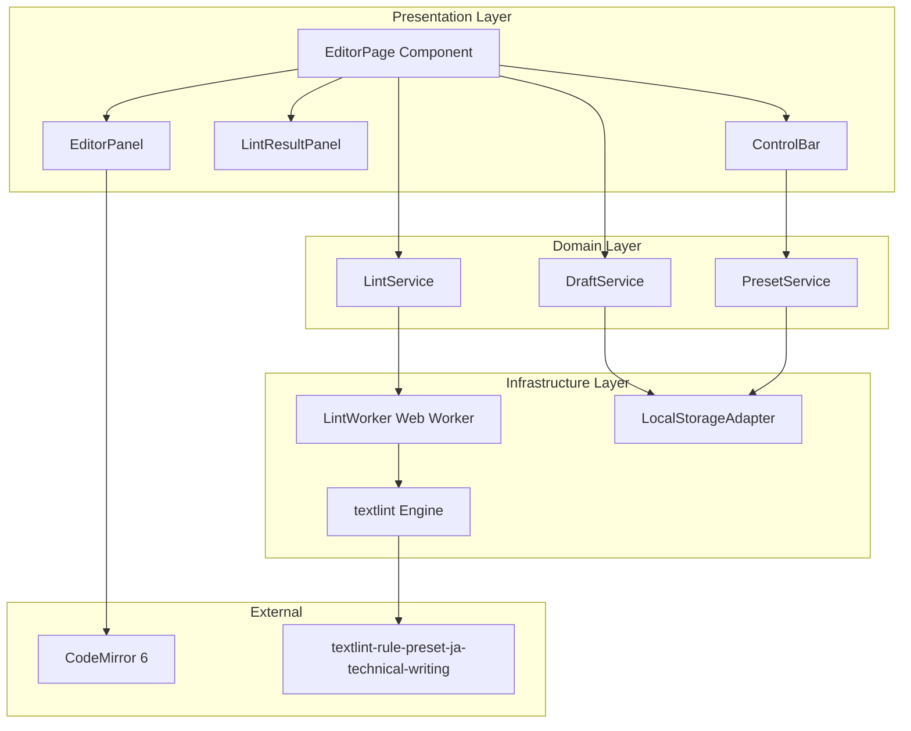

# Architecture

## Architecture Pattern & Boundary Map

選択したアーキテクチャパターン: **Layered Architecture (Presentation-Domain-Infrastructure)**



**Architecture Integration**:
- **Selected pattern**: Layered Architecture - シンプルでMVPに最適、Next.jsのApp Router構造と自然に適合
- **Domain/feature boundaries**:
  - Presentation Layer: `src/client/components/editor/` - UIコンポーネント（エディタ、指摘パネル、コントロールバー）
  - Domain Layer: `src/client/lib/services/` - ビジネスロジック（Lint実行制御、ドラフト管理、プリセット管理）
  - Infrastructure Layer: `src/client/workers/`, `src/client/lib/adapters/` - 外部依存（Web Worker、localStorage、textlint）
- **Existing patterns preserved**:
  - Next.jsのApp Router（`src/app/`）
  - フィーチャー駆動のディレクトリ構造（`src/client/components/editor/features/`）
  - "use client" + "client-only"による厳密な境界宣言
  - TypeScript strict mode
  - バレルインポート禁止
- **New components rationale**:
  - LintWorker: UI非ブロック化（Requirement 1.6, 7.1）
  - LocalStorageAdapter: 将来的な複数ドラフト管理への拡張性確保（Requirement 13.1）
  - Service層: ビジネスロジックとUIの分離、テスタビリティ向上
  - features/サブディレクトリ: 機能単位でコンポーネントを整理（marumie設計思想準拠）
- **Steering compliance**: 型安全性（strict mode）、バレルインポート禁止（個別インポート）、シンプルな構成

## Technology Stack

| Layer | Choice / Version | Role in Feature | Notes |
|-------|------------------|-----------------|-------|
| **Frontend** | Next.js 16.0.5 | App Router、SSG、クライアント専用ページ | 既存プロジェクト、Vercel最適化 |
| Frontend | React 19.2.0 | UIコンポーネント、Hooks | 既存プロジェクト |
| Frontend | TypeScript 5.x | 型安全性、strict mode | 既存プロジェクト |
| Frontend | Tailwind CSS 4.x | スタイリング | 既存プロジェクト |
| **Editor** | CodeMirror 6 | テキストエディタコンポーネント | dynamic import (ssr: false)、decorations |
| **Lint Engine** | textlint latest | 日本語文章Lint | Web Worker上で実行 |
| Lint Rules | textlint-rule-preset-ja-technical-writing | 技術記事向けルールセット | MVP唯一のプリセット |
| **Validation** | Valibot v1 | LintResultスキーマバリデーション | バンドルサイズ最小（1.37 kB） |
| **Runtime** | Bun latest | ローカル開発環境 | 既存プロジェクト |
| **Infrastructure** | Vercel | ホスティング、CDN | 既存プロジェクト |

**Key Technology Decisions**:
- **Valibot採用理由**: バンドルサイズ最小化（Zodの90%削減）、MVP段階の要件を満たす（詳細は`research.md`参照）
- **CodeMirror 6**: React統合実績豊富、decorationsによるハイライト実装、Next.js SSR制約への対応パターン確立
- **textlint**: JavaScript製でブラウザ実行可能、@textlint/script-compilerでWeb Worker最適化

## Existing Architecture Analysis

現在のプロジェクトは以下の構成：

```
src/
├── app/              # Next.js App Router (pages)
├── server/           # サーバーサイド (loaders, repositories, etc.)
├── lib/              # 共通ユーティリティ (utils.ts)
└── client/           # クライアントサイド
    ├── components/
    │   └── ui/       # 汎用UIコンポーネント (shadcn/ui)
    └── lib/          # クライアント用ヘルパー (未使用)
```

**既存の設計原則**（marumie-client.mdより）:
- **"use client" + "client-only"による厳密なクライアント境界の宣言**
- **フィーチャー駆動のディレクトリ構造**（ページ単位→機能単位で階層化）
- **TypeScript strict mode**: `tsconfig.json`で厳格な型チェック有効
- **Tailwind CSS 4.x**: ユーティリティファーストのスタイリング
- **Biome**: フォーマット・Lint（既存）
- **バレルインポート禁止**: `@/` aliasを使用した個別インポート

本機能は既存構成を尊重し、以下を追加：
- `src/app/editor/page.tsx`: エディタページ（クライアント専用）
- `src/client/components/editor/`: エディタ関連コンポーネント（ページ専用）
  - `features/`: 機能別サブディレクトリ（エディタパネル、指摘パネル、コントロールバーなど）
- `src/client/lib/services/`: ドメイン層サービス（LintService、DraftService、PresetService）
- `src/client/workers/`: textlint Web Worker
- `src/client/lib/adapters/`: インフラストラクチャアダプター（LocalStorageAdapter）
