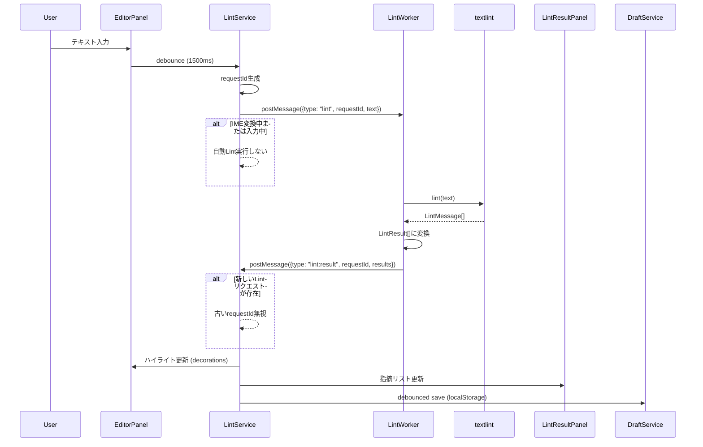
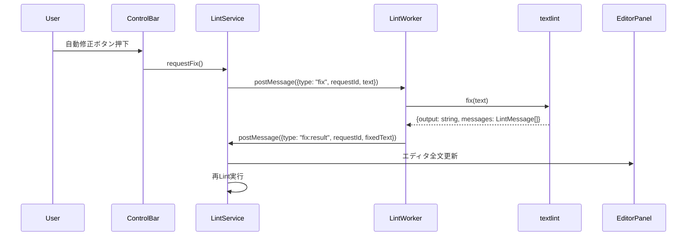
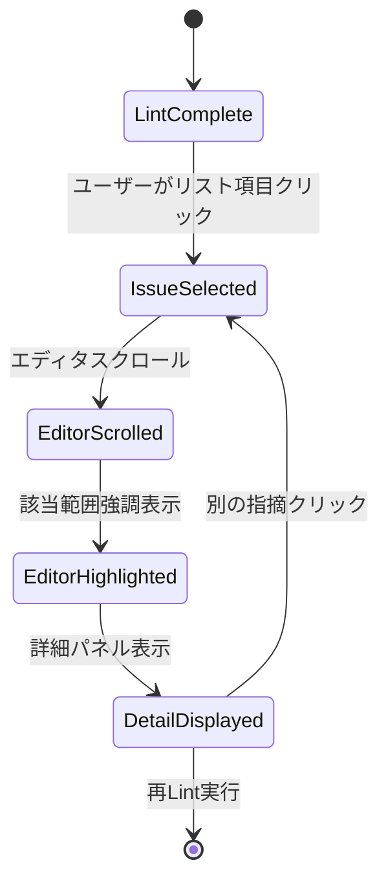
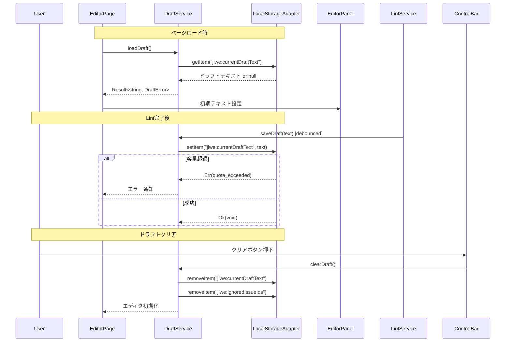

# System Flows

## Lint実行フロー

**Key Decisions**:
- debounce 1500ms: Requirement 1.3（入力停止から1500ms経過で自動Lint）
- requestIdパターン: Requirement 1.5（最新の入力状態に対する結果のみ採用）
- IME判定: `isComposing`フラグでIME変換中の自動Lint抑制（Requirement 1.4）

---

## 自動修正（Auto Fix）フロー

**Key Decisions**:
- fix APIの使用: textlint公式のfix機能を信頼（Requirement 3.7）
- 全文更新: カーソル位置のズレを許容（MVP段階、将来的にdiff適用検討）
- 自動Lint時はFix実行しない: Requirement 3.8（カーソル位置のズレによる編集妨害防止）

---

## 指摘ナビゲーションフロー

**Key Decisions**:
- startIndex/endIndexベースのスクロール: UTF-16コード単位でCodeMirrorの位置計算と整合（Requirement 2.6）
- 選択状態リセット: 再Lint完了時に選択・強調解除（Requirement 2.5）

---

## ドラフト保存・リストアフロー

**Key Decisions**:
- debounce: 1000ms待機、3000ms最大待機（Lint完了時のみ保存）
- 単一キー: `jlwe:currentDraftText`のみ使用（MVP段階）
- 容量制限エラー: ユーザーに警告表示、ドラフトクリア促進（Requirement 10.3）
